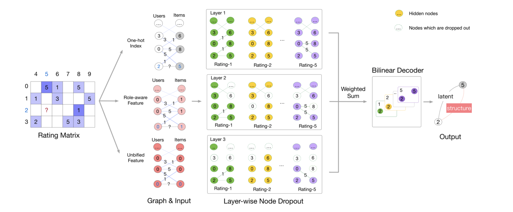

# IMC-GAE: Inductive Matrix Completion Using Graph Autoencoder for Real Recommender Systems



Paper link: 

Author's code: [https://github.com/swtheing/IMC-GAE](https://github.com/swtheing/IMC-GAE)

The implementation does not handle side-channel features and mini-epoching and thus achieves
slightly worse performance when using node features.

Credit: Wei shen ([@swtheing](https://github.com/swtheing))


## Requirements

Latest tested combination: Python 3.8.1 + PyTorch 1.4.0 + DGL 0.5.2.

Install [PyTorch](https://pytorch.org/)

Install [DGL](https://github.com/dmlc/dgl)

Other required python libraries: numpy, scipy, pandas, h5py, networkx, tqdm ,bidict etc.

## Data

Supported datasets: ml-100k, ml-1m, ml-10m, flixster, douban, yahoo_music

### How to run

To train on Flixster, type:
```bash
    python -u train.py --data_name=flixster \
                       --use_one_hot_fea \
                       --gcn_agg_accum=sum \
                       --device 0 \
                       --ARR 0.00000000000 \
                       --train_early_stopping_patience 200 \
                       --layers 2 \
                       --gcn_agg_units 30 \
                       --train_lr 0.01 \
                       --data_valid_ratio 0.1 \
                       --model_activation tanh \
                       --gcn_out_units 30
```
Results: RMSE=0.8838

To train on douban, type:
```bash
    python -u train.py --data_name=douban \
                       --use_one_hot_fea \
                       --gcn_agg_accum=sum \
                       --device 0 \
                       --ARR 0.00000000000 \
                       --train_early_stopping_patience 1800 \
                       --layers 5 \
                       --gcn_agg_units 90 \
                       --train_lr 0.01 \
                       --data_valid_ratio 0.05 \
                       --model_activation tanh \
                       --gcn_out_units 80
``` 
Results: RMSE=0.7211

To train on yahoo_music, type:
```bash
    python -u train.py --data_name=yahoo_music \
                       --use_one_hot_fea \
                       --gcn_agg_accum=sum \
                       --device 0 \
                       --ARR 0.00000000000 \
                       --train_early_stopping_patience 20 \
                       --layers 3 \
                       --gcn_agg_units 30 \
                       --train_lr 0.01 \
                       --data_valid_ratio 0.1 \
                       --model_activation tanh \
                       --gcn_out_units 30
```
Results: RMSE=18.7018

To train on MovieLens-100K, type:
```bash
    python -u train.py --data_name=ml-100k \
                       --use_one_hot_fea \
                       --device 0 \
                       --ARR 0.00004 \
                       --layers 2 \
                       --data_valid_ratio 0.05 \
                       --model_activation tanh 
```
Results: RMSE=0.8967

To train on MovieLens-1M, type:
```bash
    python -u train.py --data_name=ml-1m \
                       --use_one_hot_fea \
                       --device 0 \
                       --ARR 0.000004 \
                       --layers 2 \
                       --data_valid_ratio 0.05 \
                       --model_activation tanh 
```
Results: RMSE=0.8290
